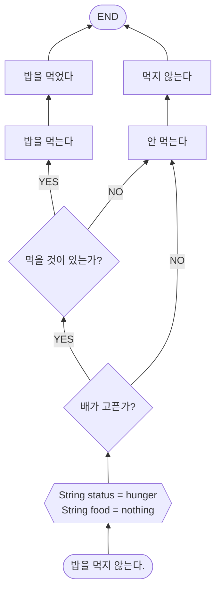
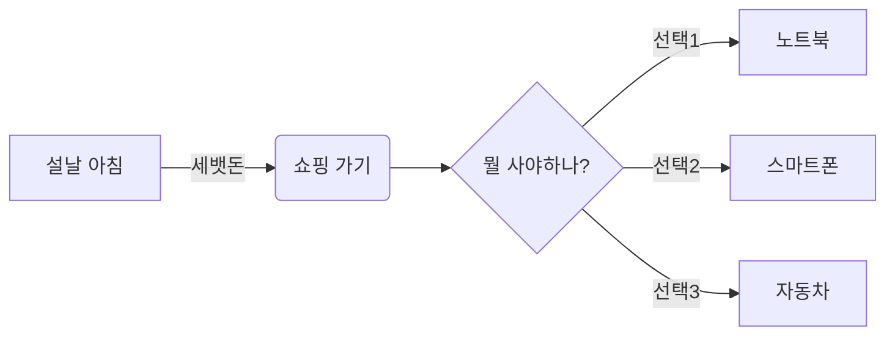
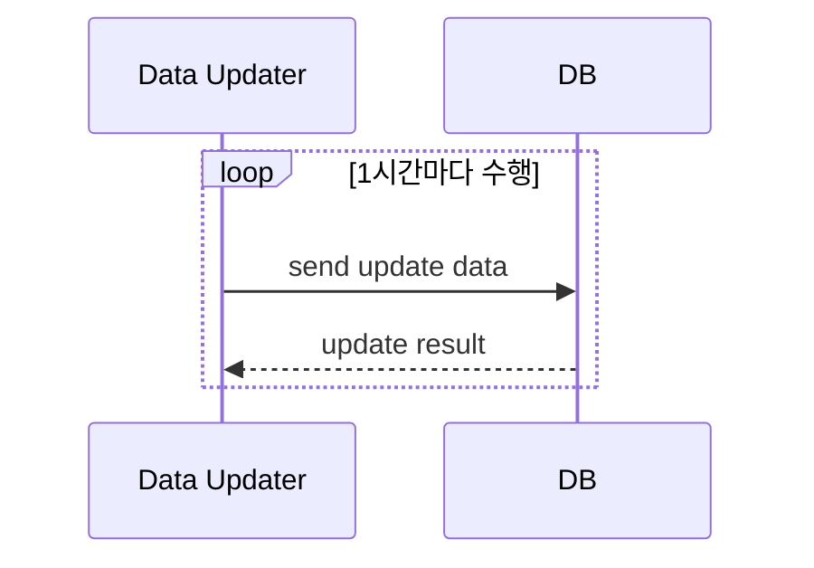
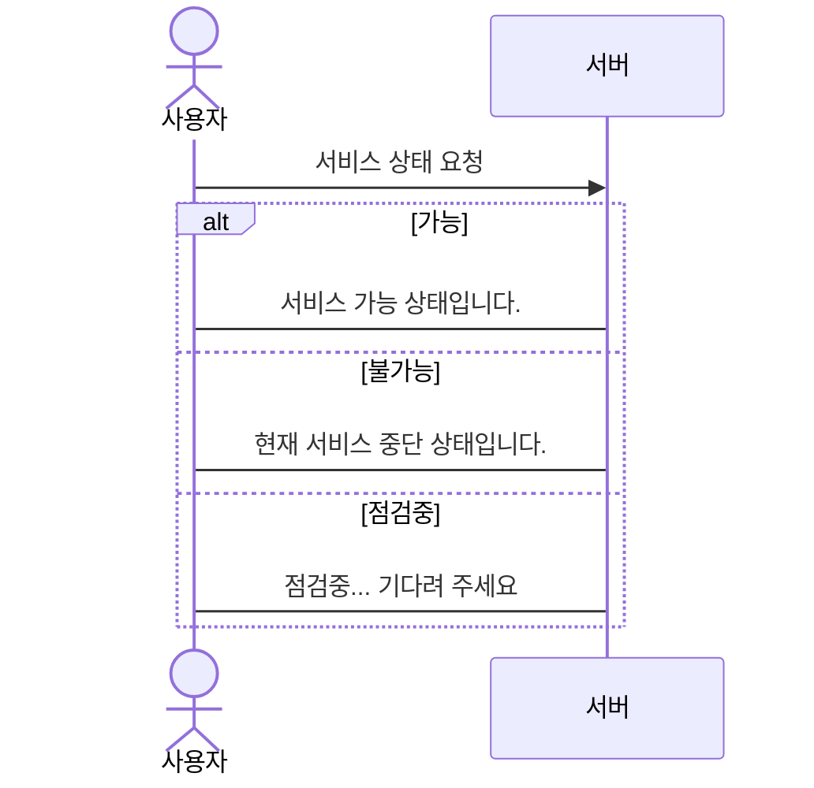
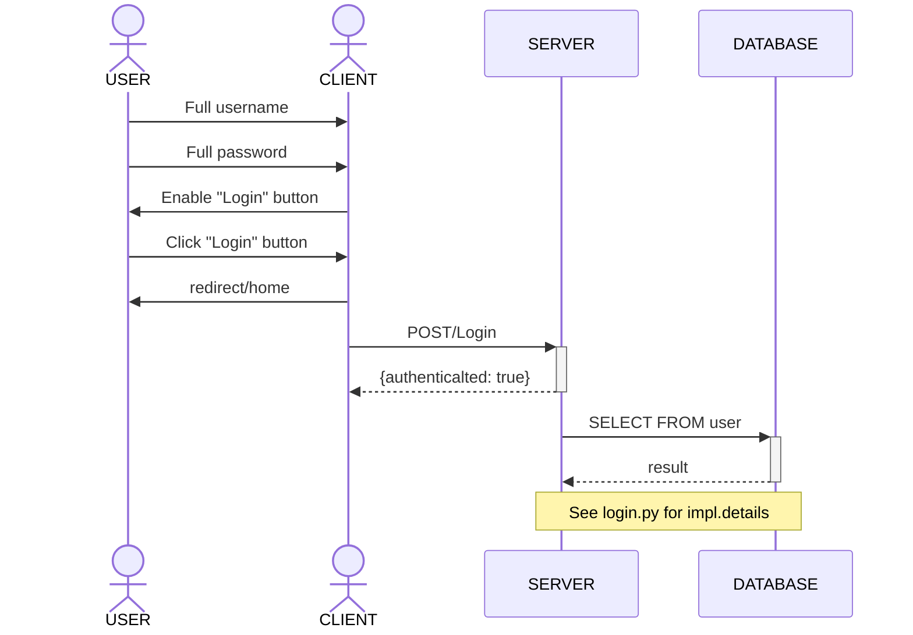
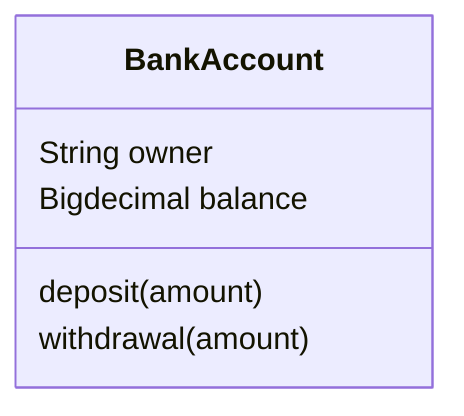
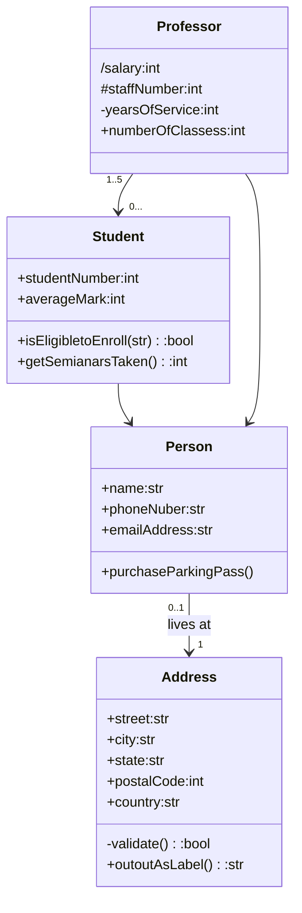

# Mermaid 실습
*    순서도 실습
*       첫번째 샘플



*       두번째 샘플

*       세번째 샘플 

*       4번째 샘플

*        5

*       6

*       7
```{mermaid}
classDiagram
    classA <|-- classB
    classC *-- classD
    classE o-- classF
    classG <-- classH
    classI <.. classJ
    classK <|.. classL
    classM -- classN
    classO .. classP
```
*       8


# END